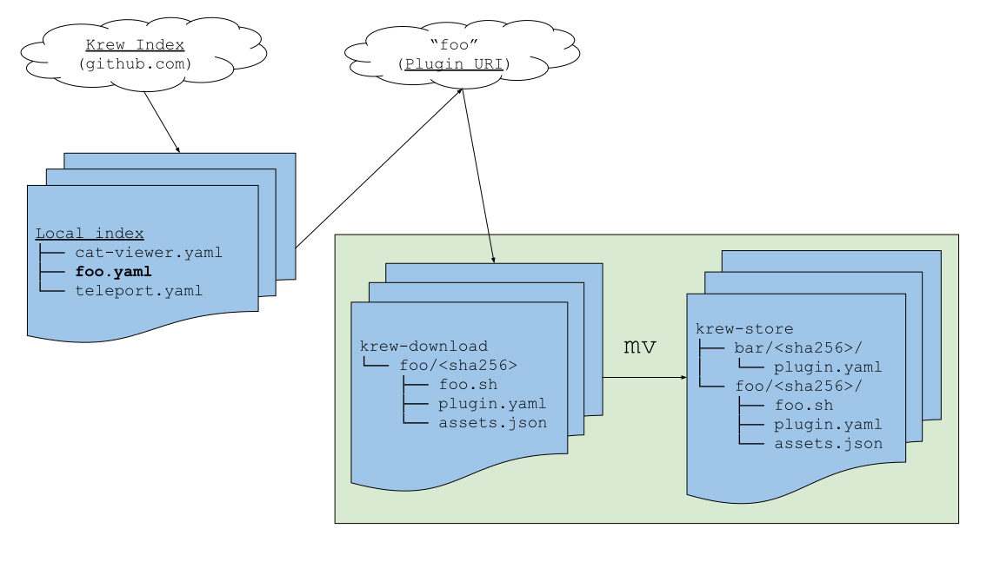
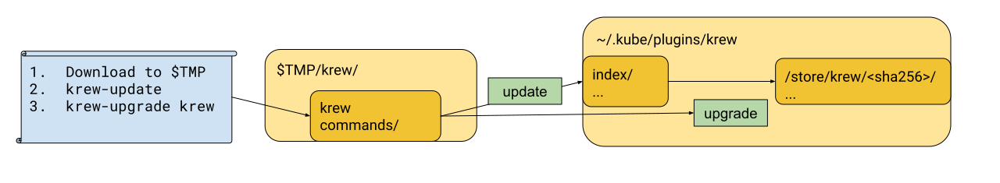

# Architecture

(This guide is intended for developers of krew.)

:warning: The instructions below are not up to date for krew v0.2+. But this
document is still retained as a reference to highlight some original design
decisions behind Krew.

<!-- TOC depthFrom:2 -->

- [Krew Plugins location](#krew-plugins-location)
    - [Directory structure](#directory-structure)
    - [Krew Index](#krew-index)
        - [Index Structure](#index-structure)
    - [Plugin Manifest File Format](#plugin-manifest-file-format)
    - [Update Index Locally](#update-index-locally)
    - [Plugin Package Format](#plugin-package-format)
- [Installation Methods](#installation-methods)
    - [Why krew should not rely on OS-Package managers](#why-krew-should-not-rely-on-os-package-managers)
- [Krew Itself as a Plugin](#krew-itself-as-a-plugin)
    - [Kubectl Plugin Descriptor (plugin.yaml) File Generation](#kubectl-plugin-descriptor-pluginyaml-file-generation)
    - [Single Binary](#single-binary)
- [Note on Potential Changes to Kubectl Plugin System](#note-on-potential-changes-to-kubectl-plugin-system)

<!-- /TOC -->



## Krew Plugins location

Kubernetes plugins can be installed to:

1. `${KUBECTL_PLUGINS_PATH}` If specified.
2. `${XDG_DATA_DIRS}/kubectl/plugins`
3. `~/.kube/plugins`

It's up to the user to specify one of the above options. In this document the
path will be referenced as `~/.kube/plugins`. This is not implementation
specific. Krew installs itself in the default plugin directory for the user.

### Directory structure

Krew installs plugins in its root path under `~/.krew/store`. Each
plugin has a directory with its uncompressed content from the URI.
Kubectl will recursively search the plugin path for plugin.yaml files. The
download directory is a temporary directory which only exists during the
execution of the install or upgrade command. Directory structure:

```text
. ($HOME)
└── .krew/
    ├── bin/
    |   ├── kubectl-foo
    ├── index/
    |   ├── foo.yaml
    |   └── krew.yaml
    └── store/
        ├── foo/<sha256>/
        |   ├── plugin.yaml
        |   └── foo.sh
        └── krew/<sha256>/
            ├── commands/
            |   ├── install/
            |   |   └── plugin.yaml
            |   └── upgrade/
            |       └── plugin.yaml
            ├── krew-install
            └── krew-upgrade
${TMPDIR}/krew/
    └── download/ (This directory is only available during installation and upgrade)
        └── foo/<sha256>/
            ├── plugin.yaml
            └── foo.sh
```

### Krew Index

As a starting point, the index holds information about all available plugins.
The index will be synced to a user machine through git. The user operates on
their local index.

The index exists as a git repository, hosted on GitHub. This allows partial
updates of the index, GPG verification of committers and rollbacks.

#### Index Structure

The repository will hold a directory of yaml files. Each describes a single
plugin. This directory is called Plugin Manifest. The file name must match with
the plugin name `<plugin-name>.yaml`. To avoid conflicting commands, there
should only be one new top level command for each plugin.

### Plugin Manifest File Format

The Plugin Manifest for a plugin itself is a yaml file. It describes the plugin
name, plugin download URI, verification hash and plugin version. Plugin manifest
supports having different installation steps to support incompatible platforms
like Unix systems and Windows.

An example Plugin Manifest file of a plugin "foo", named `foo.yaml`, can look like this:

```yaml
apiVersion: krew.googlecontainertools.github.com/v1alpha2
kind: Plugin
metadata:
  name: foo
spec:
  platforms:
  - uri: https://github.com/barbaz/foo/archive/windows-v0.5.0.tar.gz
    sha256: 29C9C411AF879AB85049344B81B8E8A9FBC1D657D493694E2783A2D0DB240775
    # This is used during installation. It uses file Globs to copy required files.
    files:
    - from: "/posix/*"
      to: "."
    selector: # A regular Kubernetes label selector
      matchExpressions:
      - {key: os, operator: In, values: [macos, linux]} 
  - uri: https://github.com/barbaz/foo/archive/windows-v0.5.0.tar.gz
    sha256: 29C9C411AF879AB85049344B81B8E8A9FBC1D657D493694E2783A2D0DB240775
    files: 
    - from: "/win/utils"
      to: "/utils"
    selector:
      matchLabels:
        os: "windows"
  # Version does not follow any conventions and is not functional.
  version: "v0.5.0"
  shortDesciption: Short description of foo!
  description: |
    This is a long description
    it will be shown to elaborate
    The plugins purpose.
  caveats: |
    This plugin needs the following programs:
    * fzf
    * jq

    For a better user experience:
      export $TERM=vt220
```

### Update Index Locally

To sync the index to the user's machine, krew requires that curl and git is installed on the
host machine. Krew is cloning or pulling the index repository to
`~/.kube/plugins/krew/index` on a `krew update`. The first pull can take some
time due to a long history, but will be fast on incremental changes. We use git
as a backend because it does already implement downloading, incremental updates
with patches and GPG signing.

### Plugin Package Format

The plugin package is found under the download URI in the Plugin Manifest.
Currently, krew only supports downloading plugin packages of formats
`.tar.gz` and `.zip` over HTTP(S) protocol.

Plugins must meet some standards even though kubectl does allow more. Krew
allows to download repositories and later copy only the needed files to a new
directory using File Globs under `.spec.platforms[].files[]`. The file field
mimics the posix mv command `mv <from> <to>`. The "to" field will be defaulted
to ".". (See example manifest for a use case.)

* To allow plugin scans and verification, the plugin.yaml file must be present in
  the root directory of the package after the files have been moved.
* There should also be only one plugin.yaml in the package.
* The plugin.yaml also has to reference an executable that is not in the parent
  repository.
* A package also should not contain symlinks.

## Installation Methods

Krew itself is also a krew plugin. To reduce the total maintenance and setup
procedure, krew is bootstrapping and dogfooding itself.


The installation on windows and linux works as follows:

1. Download the krew binary to a temp path
2. Run `krew update`
3. Run `krew install krew`
4. Delete current executed krew from the temp path

### Why krew should not rely on OS-Package managers

We can’t easily cover all possible package managers. Trying this introduces a
high maintenance overhead and a huge build pipeline. Maintaining many different
packages can also lead to various errors that need domain knowledge to resolve.

## Krew Itself as a Plugin

### Kubectl Plugin Descriptor (plugin.yaml) File Generation

Krew should be able to generate its own plugin.yaml files in its build pipeline
to reduce human errors and toil work. As a CLI framework krew should use spf13’s
cobra framework. It is possible to parse the cobra command tree and convert it
into a plugin manifest.

### Single Binary

To reduce the amount of disk space we compile krew as a single binary and
generate multiple plugin.yaml files with different entry points to the binary.
The binary then uses argv to determine which subcommand is called.

## Note on Potential Changes to Kubectl Plugin System

Kubectl Plugin system is currently alpha and is undergoing a lot of change by
SIG CLI.

We are expecting the following changes may impact Krew heavily: Intention to
move away from plugin.yaml: Community is planning to implement Git plugin model
which does not require a plugin.yaml. Intention to move away from
`~/.kube/plugins`: Community is planning to move a `$PATH` based discovery, like
the Git plugin system. This way the plugin "foo" would be named "kubectl-foo"
and placed in the `$PATH`. This will break Krew, but can be addressed through
creating a `.../krew/bin` directory and symlinking the plugin executables there.
This is very similar to what [brew](https://brew.sh/) does today.
