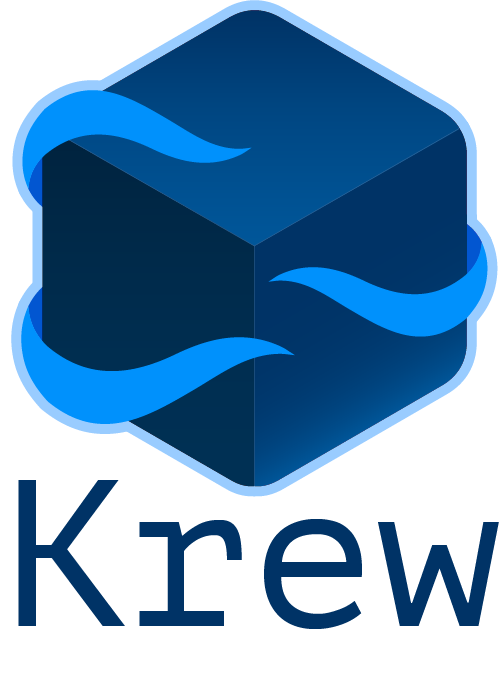
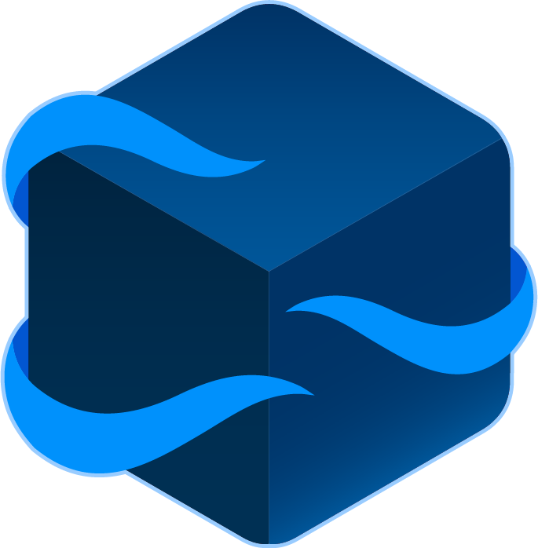

# Krew logo

Krew logo is designed by [@iboonox](https://twitter.com/iboonox) and it is
licensed under Apache 2.0 license.

Krew logo follows the nautical theme of Kubernetes: The tentacles wrapping
around the crate refer to tentacles of a cuttlefish, which is the mascot of
[kubectl](https://github.com/kubernetes/kubectl#kubectl) project, and the crate
represents a kubectl plugin package.

## Available logo types

<!-- below we use a table so we can control max height -->
<table>
    <thead>
        <tr>
            <th>Type</th>
            <th>Preview</th>
        </tr>
    </thead>
    <tbody>
        <tr>
            <td>Horizontal</td>
            <td>
                
            </td>
        </tr>
        <tr>
            <td>Stacked</td>
            <td>
                
            </td>
        </tr>
        <tr>
            <td>Icon-only</td>
            <td>
                
            </td>
        </tr>
    <tbody>
</table>

## Logo assets

| Type | Color Scheme | Format |
|--|--|--|
| horizontal (text next to the icon) | colored | [[png]](../assets/logo/horizontal/color/krew-horizontal-color.png)  [[svg]](../assets/logo/horizontal/color/krew-horizontal-color.svg) |
| horizontal (text next to the icon) | black | [[png]](../assets/logo/horizontal/black/krew-horizontal-black.png)  [[svg]](../assets/logo/horizontal/black/krew-horizontal-black.svg) |
| horizontal (text next to the icon) | white | [[png]](../assets/logo/horizontal/white/krew-horizontal-white.png)  [[svg]](../assets/logo/horizontal/white/krew-horizontal-white.svg) |
| stacked (text below the icon) | colored | [[png]](../assets/logo/stacked/color/krew-stacked-color.png)  [[svg]](../assets/logo/stacked/color/krew-stacked-color.svg) |
| stacked (text below the icon) | black | [[png]](../assets/logo/stacked/black/krew-stacked-black.png)  [[svg]](../assets/logo/stacked/black/krew-stacked-black.svg) |
| stacked (text below the icon) | white | [[png]](../assets/logo/stacked/white/krew-stacked-white.png)  [[svg]](../assets/logo/stacked/white/krew-stacked-white.svg) |
| icon-only | colored | [[png]](../assets/logo/icon/color/krew-icon-color.png)  [[svg]](../assets/logo/icon/color/krew-icon-color.svg) |
| icon-only | black | [[png]](../assets/logo/icon/black/krew-icon-black.png)  [[svg]](../assets/logo/icon/black/krew-icon-black.svg) |
| icon-only | white | [[png]](../assets/logo/icon/white/krew-icon-white.png)  [[svg]](../assets/logo/icon/white/krew-icon-white.svg) |
