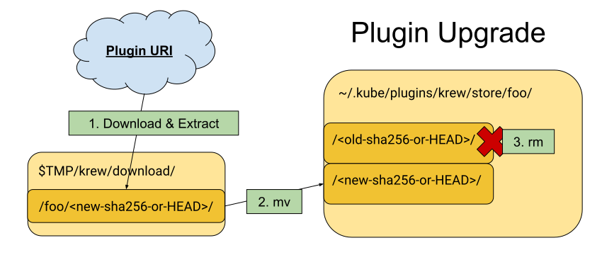
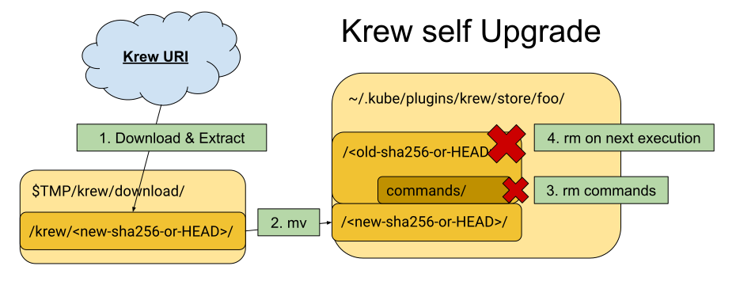

# Plugin Lifecycle

(This guide is intended for developers of Krew.)

:warning: The instructions below may not be up to date for krew v0.2 and higher.
It is provided as a reference to learn how Krew works under the covers, but
may not be entirely accurate.

## Installation

The plugins will be downloaded and checked against its sha256 to verify the
integrity. The package will be uncompressed into a directory called
`${TMP}/krew/download/<plugin-name>/<sha256>/`. Then the directory will
be renamed (mv) to `~/.krew/store/<plugin-name>/<sha256>/`.
This ensures a partially atomic and idempotent operation on most file systems.

## Upgrade

Upgrading is more difficult because we already have a plugin that is working.
Krew should not destroy a working environment. The operations should be
idempotent. If something fails we should be able to recover to the wanted state.

Upgrading works by iterating over the `~/.krew/store/` directory
names and comparing the current hash to the corresponding index file. When a
hash differs the plugin gets installed again.

Install the plugin:

1. Delete the old version
2. Therefore it‘s not possible for plugins to store
   data in the plugin directory.

In case any plugin operation does not succeed the plugin directory is not
damaged under the assumption that mv is atomic. If another plugin
upgrade/install command is issued and a directory in download still exists or
two plugin version directories exist in `/store/<plugin-name>/`, krew assumes
that the previous operation failed.

Krew informs the user and retries to reinstall the package.

On Windows it is not possible to modify a file/directory which is currently in
use. This requires a special case for upgrading krew, which itself is a plugin,
from krew. If krew upgrades itself, it is installing itself, instead of deleting
the whole old directory it just deletes the old `/commands/` directory witch
holds all the plugin descriptor files.

This way only the new krew version is executed. If krew upgrade is executed
again the old version directory gets deleted.
